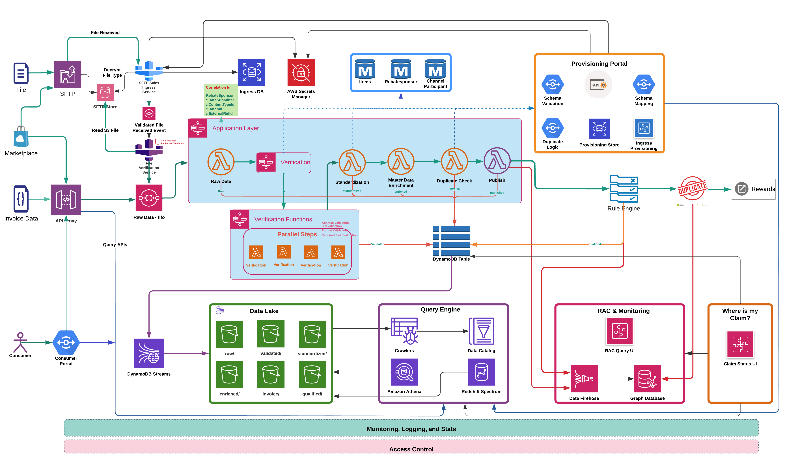
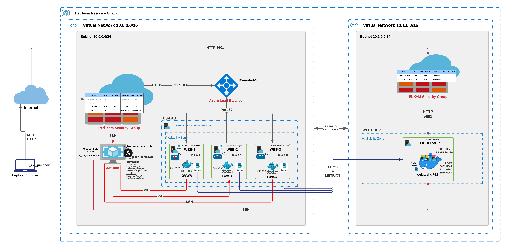
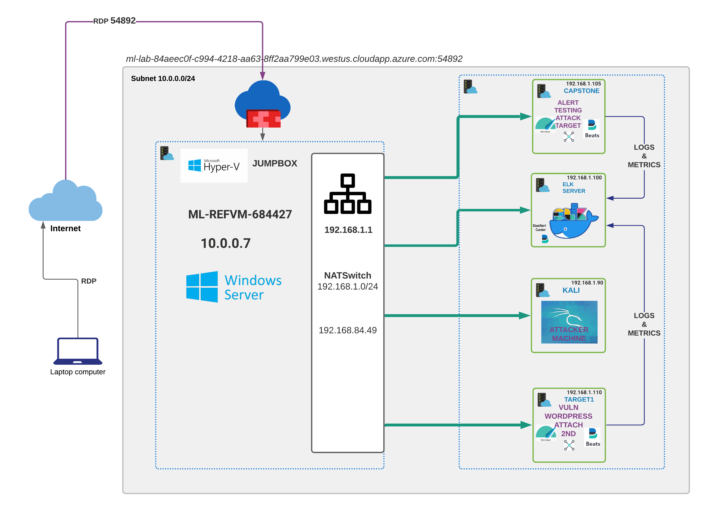

 

Hello, this is **Karnan Seevaratnam**

A visionary leader in technology with a track record of maximizing the use of the latest technology to solve
industry problems. I am a dedicated and proven leader with 20 years of experience in the field of Information Technology, with
expertise in the telecommunication, education, charity and retail and loyalty industries. As an ardent follower of Agile and Lean methodology, I am always looking to find the most innovative ways to save time, improve efficiency and maximize profitability.

Leads architecture, IT governance teams and manages enterprise solutions to optimize the user experience, minimize redundancies and maximize profitability.
 
## 🛠 Technologies & Tools

&nbsp;
&nbsp;
&nbsp;
&nbsp;
&nbsp;
&nbsp;
&nbsp;
&nbsp;
&nbsp;
\
&nbsp;
&nbsp;

 

## 📝 Projects
### Architecture Design & Solutions
* #### [Straight Through Claim Processing](https://github.com/seevaratnam/zero-touch-claim-processing-design)
    
### Machine Learning & AI Projects
* #### [Natural Language Processing – Conversation Analytics](https://github.com/team-bathurst/891/blob/main/MMAI891_Online_Orders_TFIDF.ipynb)
    * Built a text classification model that can classify new messages into one of the given (predefined) topics.
* #### [Predicting the Stock Markets with Naive Machine Learning](https://github.com/team-bathurst/823/blob/main/session4/Session%204%20-%2002%20-%20Algorithm%20Trading%20-%20ML.ipynb)
* #### [Reinforcement Learning - Inventory Control](https://github.com/team-bathurst/845)
    * Inventory control needs to be optimized in order to maximize profit by having sufficient product available to sell—thereby also reducing lost sales—and minimizing unsold product.

### Cybersecurity Projects
* #### [Automated ELK Stack Azure Deployment](https://github.com/seevaratnam/elk-server)
    
    
* #### [Azure SOC infrastructure](https://github.com/seevaratnam/BCS)
    

## 🤝🏻 &nbsp;Connect with Me

 
&nbsp;
&nbsp;

 

Last edited on: 06/14/2022
